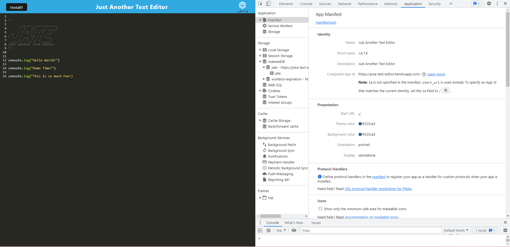
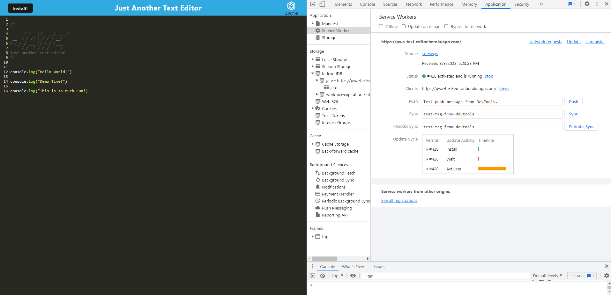
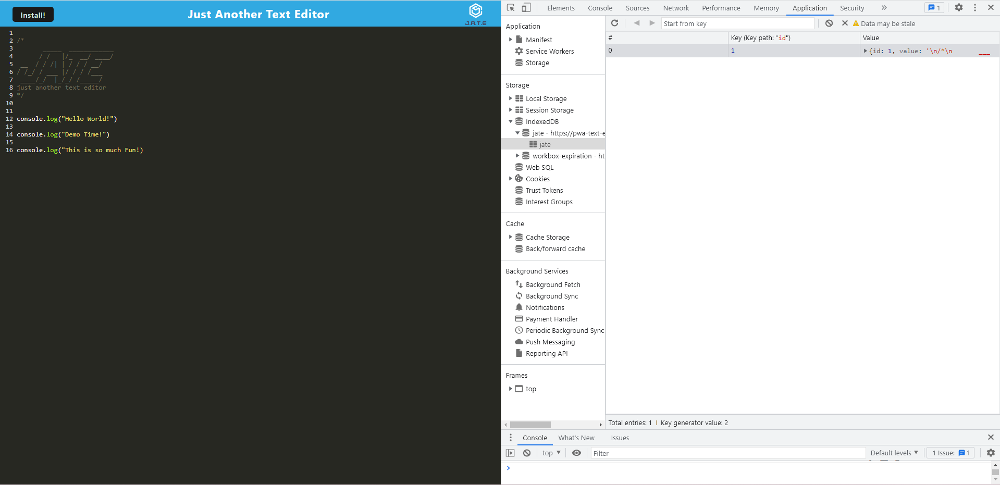

# PWA Text Editor

## Project Summary

The goal of this assignment was to create a PWA text editor application with the existing code we were given, that runs in the browser and has been deployed to Heroku. The app is a single page application that meets the PWA requirements. The application features a number of data persistence techniques that serve as redundancy in case one of the options is not supported by the browser. The application also functions offline.

### Here is the link to the PWA Text Editor App deployed in Heroku.

[Click here to see my PWA Text Editor App deployed in Heroku.](https://pwa-text-editor.herokuapp.com/)

The following image shows the application's `manifest.json` file:

The following image shows the application's registered service worker:

The following image shows the application's IndexedDB storage:

